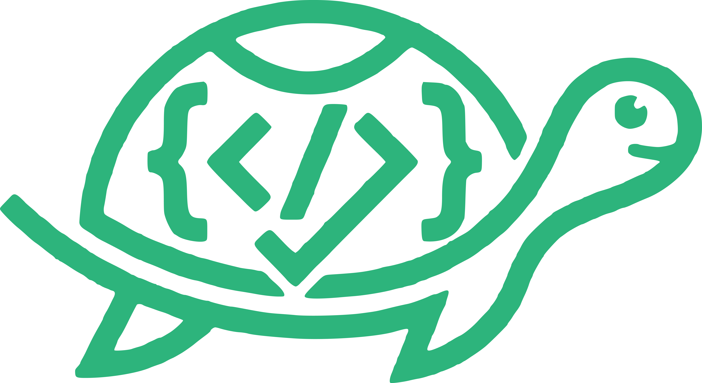

<p align="center">
  
</p>

<h1 align="center">Code Turtle</h1>

<p align="center">
  <strong>Local AI code reviewer for GitHub &amp; GitLab — any model, no cloud.</strong><br />
  Review pull requests with Gemini, Claude, OpenAI, OpenRouter, Groq, Ollama, LM Studio, or any OpenAI-compatible endpoint. Everything runs on your machine. No server, no webhooks, no cloud.
</p>

<p align="center">
  <a href="https://www.npmjs.com/package/code-turtle"></a>
  <a href="https://github.com/jaisuriya97/CodeTurtle/blob/main/LICENSE"></a>
  <a href="https://github.com/jaisuriya97/CodeTurtle"></a>
  <a href="https://www.typescriptlang.org/"></a>
  <a href="https://github.com/jaisuriya97/CodeTurtle/pulls"></a>
  <a href="https://github.com/jaisuriya97/CodeTurtle/actions"></a>
</p>

<!-- <p align="center">
  <a href="https://github.com/jaisuriya97/CodeTurtle/stargazers"></a>
  <a href="https://github.com/jaisuriya97/CodeTurtle/network/members"></a>
  <a href="https://github.com/jaisuriya97/CodeTurtle/issues"></a>
  <a href="https://github.com/jaisuriya97/CodeTurtle/blob/main/CHANGELOG.md"></a>
  <a href="https://github.com/jaisuriya97/CodeTurtle"></a>
</p> -->

---

## What is Code Turtle?

**Code Turtle** (`codeturtle`) is an npm-distributed CLI/TUI that reviews GitHub PRs and GitLab MRs with any OpenAI-compatible LLM — cloud or local. There is **no server and no webhooks**: reviews run entirely on the user's machine, triggered by pasting a PR link in the TUI or by polling watched repos.

It's not another SaaS bot. It's a single binary you install once, point at the model of your choice, and let it watch your repos. Findings land as inline comments plus a single summary review on the PR, deduped across runs so re-reviews only post what changed.

---

## Why Code Turtle?

| Aspect              | SaaS code-review bots     | Code Turtle                                             |
| ------------------- | ------------------------- | ------------------------------------------------------- |
| Where it runs       | Vendor cloud              | Your machine — local-first                              |
| Where code goes     | Uploaded to a third party | Never leaves your laptop                                |
| Model choice        | Locked to vendor's model  | Any OpenAI-compatible endpoint (cloud or local)         |
| Forge support       | GitHub only, usually      | GitHub & GitLab, first-class                            |
| Auth                | OAuth + webhook install   | OAuth / `gh` CLI / PAT / GitHub App / GitLab token      |
| Posting backend     | Vendor proxy              | GitHub's official MCP server (default) or REST fallback |
| Offline capable     | No                        | Yes — fully usable with Ollama or LM Studio             |
| Custom review rules | Vendor UI                 | Drop-in `.codeturtle.yml` + global norm packs           |
| Cost model          | Per-seat subscription     | Pay only for the model calls you make                   |

---

## Key Features

- **Multi-provider out of the box** — Gemini, Claude, OpenAI, OpenRouter, Groq, Ollama, LM Studio, or any custom OpenAI-compatible endpoint. Local servers get live model detection.
- **GitHub + GitLab, first-class** — GitHub I/O goes through the official GitHub remote MCP server; GitLab I/O is REST v4. Both have soft-fail and lock-aware pipelines.
- **Smart context, not just diffs** — pulls changed files, their imports, callers, and tests from the repo at the head commit, ranked and budgeted.
- **One native review per run** — inline comments + a single summary review (create → add → submit pending), with labels and dedup via hidden HTML markers.
- **Idempotent re-reviews** — pushes only post new findings; markers carry a `±3 line tolerance` for LLM anchor jitter.
- **Idempotent push reviews** — the same marker scheme works for commit comments on plain branch pushes, deduped per head commit.
- **Custom norms, layered** — built-in defaults ← your personal global norms ← the repo's `.codeturtle.yml` (project wins). Package reusable rule sets as **packs** (`.yml`) or, for power users, **code transforms** (`.mjs`); repos opt into packs by name via `extends`. Reviewer/key overrides and code execution from repo files are **ignored for security**. See the [Custom Norms Guide](docs/custom-norms-guide.md).
- **GitHub App identity** — reviews can post as `<app-slug>[bot]` (RS256 JWT → installation token, all on your machine). Still no server.
- **Watch + dashboard** — pick repos, get a live TUI: open/closed PR tabs, auto-watch, events feed, manual refresh (`R`). Watching runs inside the TUI session (a detached background daemon is on the [roadmap](#project-status)).
- **Strict reviewer validation** — hostile LLM output is filtered, not trusted; findings below the configured confidence threshold are dropped before posting.

---

## Installation

```bash
npm install -g code-turtle
```

Or run without installing:

```bash
npx code-turtle
```

> Requires **Node.js ≥ 22.12** (the floor set by `commander@15` and `ink@7`).

---

## Quick Start

```bash
codeturtle          # opens the TUI — first run walks you through setup
```

**First run walks you through three steps:**

1. **Pick a provider** — Gemini, Claude, OpenAI, OpenRouter, Groq, Ollama (local), LM Studio (local), or any custom OpenAI-compatible endpoint. Local servers get live model detection. Always use a higher / more capable model for better review results.
2. **Connect a forge (once)** — one menu: sign in with GitHub (OAuth device flow, set `GITHUB_CLIENT_ID`), use your `gh` CLI session, paste a GitHub PAT, or paste a GitLab token. One is enough; you can optionally connect another afterwards.
3. **Pick repos to watch** — `github:owner/repo gitlab:12345`

---

## Scripting

The bare command opens the TUI. For scripting there are three subcommands — `review`, `status`,
and `reset`:

```bash
codeturtle review https://github.com/owner/repo/pull/42      # one-off review (paste a link)
codeturtle review --forge github --repo owner/repo --pr 42   # …or pass flags
codeturtle status                                            # connection + model status
codeturtle reset                                             # wipe local config (-y to skip prompt)
```

> A background daemon (`start` / `logs` / `stop`) is on the [roadmap](#project-status). Today,
> background watching runs inside the TUI session.

---

## How it reviews

- **Smart context**: not just the diff — pulls changed files, their imports, callers, and tests from the repo at the head commit
- **GitHub via MCP**: all GitHub I/O goes through GitHub's official MCP server; findings post as one native PR review (inline comments + summary)
- **Custom norms, layered**: defaults ← your global norms & packs ← the repo's `.codeturtle.yml` (project wins); package rules as `.yml` packs or `.mjs` transforms (reviewer/key overrides and repo-triggered code are ignored for security) — see the [Custom Norms Guide](docs/custom-norms-guide.md)
- **Idempotent**: re-reviews after a push only post new findings (±3 line tolerance for anchor jitter)

---

## Configuration

Everything lives in `~/.codeturtle/` — `credentials.json`, `config.json`, `watcher.log`. Env vars (`GITHUB_TOKEN`, `GITLAB_TOKEN`, `REVIEWER_API_KEY`, `REVIEWER_BASE_URL`, `REVIEWER_MODEL`) override the store.

Files in `~/.codeturtle/` are written with `chmod 600`. Secrets are never logged, never echoed in errors, and never written outside that directory.

---

## Architecture

The data flow is the same whether the trigger is a pasted PR link, the CLI, or the polling watcher — everything funnels through one entrypoint.

```
  cli / tui  ──►  pipeline.runReview(job)  ──►  forge client  (GitHub MCP / GitLab REST)
                          │                            │
                          │                            ├─ getMr / getDiffs / getFile
                          ▼                            │
                      bundler  ◄───────────────────────┘   (changed files + imports + callers + tests)
                          │
                          ▼
                      reviewer  ──►  LLM (OpenAI-compatible)  ──►  strict-validated findings
                          │
                          ▼
                       poster   ──►  inline comments + one summary review + labels
```

Layered norms resolve as: `defaults ← global config & packs ← target repo's .codeturtle.yml` (project wins on conflict). Repo files can never redirect the reviewer or set keys — `agent` and `key_ref` are stripped before merge.

---

## Project Facts

- **Language:** TypeScript (strict), ESM only, Node ≥ 22.12
- **TUI:** React + [Ink](https://github.com/vadimdemedes/ink)
- **GitHub I/O:** official GitHub remote MCP server (default) — REST fallback available
- **GitLab I/O:** REST v4
- **LLM:** the `openai` SDK pointed at any compatible base URL
- **Build:** [`tsup`](https://tsup.egoist.dev/) → `dist/cli.js` (single bin)
- **Tests:** [Vitest](https://vitest.dev) — specs co-located in `src/**/__tests__/`, invariants locked in `invariants.test.ts`, coverage enforced in CI

---

## Documentation

Full developer docs live in [`docs/`](docs/README.md) — architecture, a per-module engine reference, the TUI components, configuration, and the hard invariants. Start at [`docs/README.md`](docs/README.md).

| #   | Doc                                              | What you'll learn                                                     |
| --- | ------------------------------------------------ | --------------------------------------------------------------------- |
| 1   | [Getting Started](docs/getting-started.md)       | Install, build, run, and do your first review                         |
| 2   | [Architecture](docs/architecture.md)             | The big picture: layers, modules, and the review data flow            |
| 3   | [Engine Reference](docs/engine-reference.md)     | Every module in `src/engine/` — what it does and its public surface   |
| 4   | [TUI Reference](docs/tui-reference.md)           | The React + Ink components in `src/tui/`                              |
| 5   | [Configuration](docs/configuration.md)           | `~/.codeturtle` store, env vars, and per-repo `.codeturtle.yml` norms |
| 6   | [Hard Invariants](docs/invariants.md)            | The seven rules you must not break — security, idempotency, locking   |
| 7   | [Custom Norms Guide](docs/custom-norms-guide.md) | Build your own review rules and norm packs                            |
| 8   | [Glossary](docs/glossary.md)                     | Domain terms: forge, norms, finding, context bundle, marker           |

---

## Contributing

Contributions are welcome! Please check out [CONTRIBUTING.md](CONTRIBUTING.md) and our [Code of Conduct](CODE_OF_CONDUCT.md) for guidelines on how to get started.

**Quick local test** — build and link to test your changes as a global command:

```bash
npm run build && npm link
codeturtle status   # now uses your local build
npm unlink -g code-turtle   # undo when done
```

See [CONTRIBUTING.md](CONTRIBUTING.md#testing-locally-with-npm-link) and [docs/getting-started.md](docs/getting-started.md#test-locally-with-npm-link) for full details.

**Good first contributions:**

- Adding a new LLM provider preset in `src/engine/providers.ts`
- Contributing an example norm pack or transform to the [Custom Norms Guide](docs/custom-norms-guide.md)
- Improving TUI key hints or status badges
- Writing missing tests in `src/**/__tests__/`
- Documentation fixes

---

## Project Status

| Version    | Status  | Description                                                                                                                                                                                                                                        |
| ---------- | ------- | -------------------------------------------------------------------------------------------------------------------------------------------------------------------------------------------------------------------------------------------------- |
| v2.1.0     | Stable  | Layered custom norms — personal **global** norms plus reusable **packs** (`.yml`) and **code transforms** (`.mjs`), with `extends` for per-repo opt-in. GitHub OAuth/App sign-in, push reviews, Vitest suite + invariant tests, CI + OIDC release. |
| v2.0.0     | Stable  | TypeScript rewrite — CLI/TUI reviewing GitHub PRs and GitLab MRs with any OpenAI-compatible model. Python implementation removed. Multi-pass review, provider key validation, watcher and lock failsafes.                                          |
| Unreleased | Planned | Background daemon (`start` / `logs` / `stop`) · per-language norm packs auto-selected by file type · TUI manager for installed packs.                                                                                                              |

See [CHANGELOG.md](CHANGELOG.md) for the full history.

---

## License

This project is licensed under the MIT License — see the [LICENSE](LICENSE) file for details.
